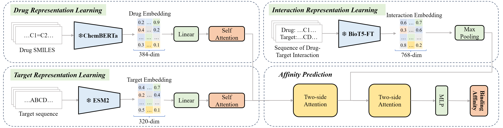

# LMDTA: Molecular Pre-trained and Interaction Fine-tuned Attention Neural Network for Drug-Target Affinity Prediction

## 1. Introduction

This repository contains the source code and datasets for **[Hu et al., LMDTA: Molecular Pre-trained and Interaction Fine-tuned Attention Neural Network for Drug-Target Affinity Prediction](https://doi.org/10.1109/BIBM62325.2024.10821881)**, BIBM 2024.

LMDTA effectively integrates advanced molecular and protein sequence language models (ChemBERTa, ESM-2, BioT5), and employs a **two-side attention mechanism** to model fine-grained drug-target interactions. This approach significantly improves the prediction performance for binding affinities, as validated on benchmark datasets.

## 2. Overview



Fig1. Framework of LMDTA.

The architecture of LMDTA consists of four modules:

- **Drug Representation Learning (ChemBERTa)**: Encodes molecular SMILES into token-level embeddings.
- **Protein Representation Learning (ESM-2)**: Encodes amino acid sequences into token-level protein embeddings.
- **Interaction Representation Learning (BioT5-FT)**: Captures high-order interactions between drug-protein pairs via a fine-tuned language model.
- **Affinity Prediction (Two-Side Attention)**: Fuses all embeddings using attention mechanism to predict affinity scores.


## 3. Environment Setup

We recommend using the following setup:

```bash
conda create -n lmdta_env python=3.10
conda activate lmdta_env
pip install -r requirements.txt
```

## 4. Basic Usage

### (1) dataset

The model supports benchmark datasets:

- **Davis**: 78 drugs × 367 proteins, with Kd values
- **Metz**: 35259 interactions across 1423 compounds × 170 kinases

Each sample consists of:

- `drug_SMILES`
- `protein_FASTA`
- `affinity_value`

The loader (`dataset.py`) maps sequences to token embeddings and loads pre-processed molecular/protein/pair embeddings.

> 💡 Drug and protein embeddings are extracted beforehand using pre-trained models and loaded via dictionaries.

### (2) main code

- `main.py`: Model training and evaluation script
- `model.py`: Definition of LMDTA architecture
- `dataset.py`: Dataset wrapper and collate function. The loader maps sequences to token embeddings and loads pre-processed molecular/protein/pair embeddings.

### (3) result

After running the `main.py` script, the model's performance on the test set will be saved in the `The_result.txt` file under the current working directory.

The file contains the following evaluation metrics:

- **MSE**: Mean Squared Error
- **MAE**: Mean Absolute Error
- **R²**: Coefficient of determination
- **CI**: Concordance Index
- **RM²**: modified coefficient of determination
- **PS**: Pearson Correlation Coefficient
- **SM**: Spearman Rank Correlation Coefficient


## 5. Citation and Contact

If you find LMDTA useful for your research, please consider citing the following paper:

M. Hu, K. Yang, K. Xu and X. Zhou, "LMDTA: Molecular Pre-trained and Interaction Fine-tuned Attention Neural Network for Drug-Target Affinity Prediction," *2024 IEEE International Conference on Bioinformatics and Biomedicine (BIBM)*, Lisbon, Portugal, 2024, pp. 181-184, doi: 10.1109/BIBM62325.2024.10821881.


```bibtex
@INPROCEEDINGS{10821881,
  author={Hu, Minjie and Yang, Kuo and Xu, Kuan and Zhou, Xuezhong},
  booktitle={2024 IEEE International Conference on Bioinformatics and Biomedicine (BIBM)}, 
  title={LMDTA: Molecular Pre-trained and Interaction Fine-tuned Attention Neural Network for Drug-Target Affinity Prediction}, 
  year={2024},
  volume={},
  number={},
  pages={181-184},
  doi={10.1109/BIBM62325.2024.10821881}}
```

If you have questions or suggestions, please contact:


 **Kuo Yang** ([kuoyang@bjtu.edu.cn](mailto:kuoyang@bjtu.edu.cn))

**Minjie Hu** ([minjiehu@bjtu.edu.cn](mailto:minjiehu@bjtu.edu.cn))

Welcome to follow our project on GitHub: <a>https://github.com/2020MEAI </a>

